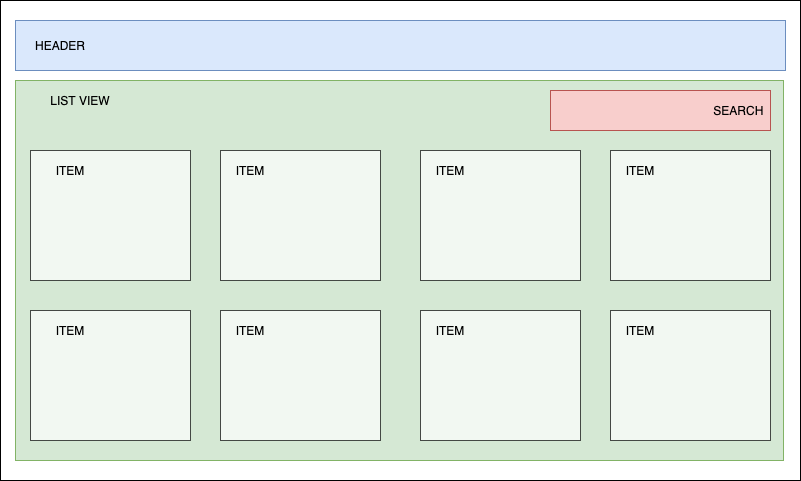
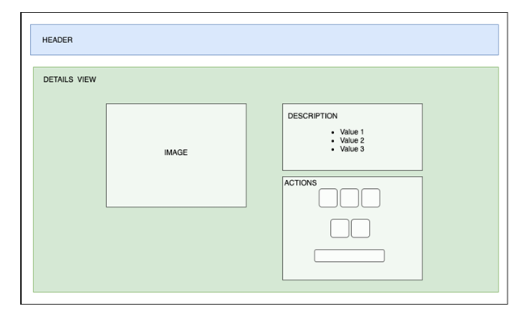

# Vistas

La aplicación tiene dos vistas. Ambas incluyen la [cabecera](./03-componentes.md#cabecera-header).

## PLP — Product List Page

Página del listado de productos.

- Muestra todos los elementos que devuelve la petición al API.
- Permite filtrar el contenido según el criterio de búsqueda que introduzca el usuario. Ver [barra de búsqueda](./03-componentes.md#barra-de-búsqueda-search).
- Al seleccionar un producto, navega a su detalle.
- Muestra un máximo de cuatro elementos por fila y se adapta a la resolución.

Wireframe:

Regiones de la captura, de arriba a abajo:

1. `HEADER` a ancho completo.
2. Área `LIST VIEW`.
3. `SEARCH` alineado a la derecha, en la parte superior del listado.
4. Rejilla de `ITEM`: cuatro por fila.

## PDP — Product Details Page

Página de detalle. Se divide en dos columnas:

- Primera columna: imagen del producto.
- Segunda columna: detalles y acciones del producto.

Debe mostrar un enlace para volver al listado de productos.

Wireframe:

Regiones de la captura:

1. `HEADER` a ancho completo.
2. Área `DETAILS VIEW` en dos columnas.
3. Columna izquierda: `IMAGE`.
4. Columna derecha, apilada: `DESCRIPTION` (lista de valores) y `ACTIONS` (selectores de opciones y botón).
